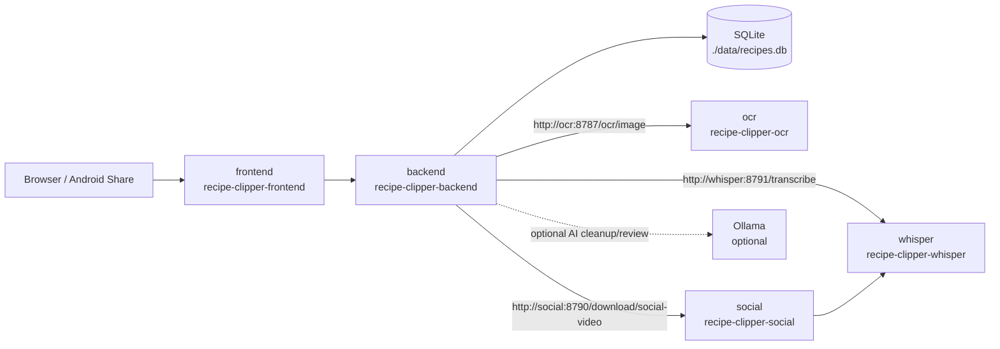

# Recipe Clipper Architecture

Recipe Clipper `1.0.0` uses the V1 architecture: a simple Docker Compose deployment with isolated workers and optional AI enhancement.

## Service Communication

- `frontend` serves the SPA and talks to `backend` over the published backend API.
- `backend` is the orchestrator. It owns auth, session handling, recipe CRUD, import flow state, AI review state, service status aggregation, and SQLite access.
- `backend` calls worker endpoints by Docker Compose service name:
  - `ocr` at `http://ocr:8787/ocr/image`
  - `social` at `http://social:8790/download/social-video`
  - `whisper` at `http://whisper:8791/transcribe`
- `social` and `whisper` share downloaded media through the Compose-mounted `./data/social-downloads` volume.
- SQLite storage is mounted from `./data` into the backend container and remains the V1 system of record.
- Ollama is optional and is used only for AI cleanup and AI review enhancement. Core import, save, and edit flows must keep working without it.

## Configuration Map

- Host-published ports are configured with `FRONTEND_PORT`, `BACKEND_PORT`, `OCR_WORKER_PORT`, `SOCIAL_DOWNLOADER_PORT`, and `WHISPER_PROCESSOR_PORT`.
- `SOCIAL_DOWNLOADER_PORT` and `WHISPER_PROCESSOR_PORT` are legacy-compatible variable names retained for the current `social` and `whisper` worker services.
- Backend-to-worker routing is configured with `OCR_WORKER_URL`, `SOCIAL_DOWNLOADER_URL`, and `WHISPER_PROCESSOR_URL`. The social and whisper variable names are also legacy-compatible names retained by the runtime. In the default Compose setup these resolve by service name and usually should not be changed.
- Shared social import artifacts are configured with `SOCIAL_VIDEO_TMP_DIR` and `SOCIAL_DOWNLOADER_OUTPUT_DIR`, both of which point at the mounted `./data/social-downloads` path by default.
- Whisper worker defaults are configured with `WHISPER_MODEL`, `WHISPER_DEVICE`, and `WHISPER_COMPUTE_TYPE`.
- Ollama integration is configured with `OLLAMA_BASE_URL`, `OLLAMA_MODEL`, and `OLLAMA_TIMEOUT_SECONDS`. Leaving `OLLAMA_BASE_URL` blank disables Ollama-dependent features without breaking core recipe flows.
- Auth bootstrap and browser session behavior are configured with `AUTH_BOOTSTRAP_ADMIN_EMAIL`, `AUTH_BOOTSTRAP_ADMIN_PASSWORD`, `AUTH_SESSION_TTL_HOURS`, `AUTH_COOKIE_NAME`, `AUTH_COOKIE_SECURE`, `AUTH_COOKIE_DOMAIN`, and `CORS_ALLOW_ORIGINS`.

## Runtime Containers

- `recipe-clipper-frontend`
- `recipe-clipper-backend`
- `recipe-clipper-ocr`
- `recipe-clipper-social`
- `recipe-clipper-whisper`

## Compose Layout

The tracked root `docker-compose.yml` builds the runtime stack from these repository directories:

- `./frontend`
- `./backend`
- `./ocr-worker`
- `./social-worker`
- `./whisper-worker`

## V1 Stability Principles

Recipe Clipper is currently a V1 freeze candidate / pre-beta codebase. Changes should prioritize stability, deterministic behavior, and portable self-hosting over experimentation.

### Import Flow Boundaries

- Keep the current staged import flow lightweight.
- Do not introduce websocket progress systems, Redis queues, Celery, Kafka, or other distributed job infrastructure unless explicitly requested.
- The current staged progress UX is the intended V1 behavior; improvements should stay limited to messaging, reset behavior, and failure visibility.

### Worker Isolation

- Keep OCR, social download, and Whisper transcription in their dedicated worker services.
- Do not merge heavy worker dependencies back into the backend.

### Optional Ollama

- Ollama is enhancement-only.
- Core recipe import, save, and edit flows must continue to work when Ollama is disabled, unreachable, or AI review is turned off.
- Graceful degradation is preferred over hard failure when Ollama is unavailable.

### Runtime Portability

- Keep Docker Compose portable and self-host friendly.
- Do not hardcode local IPs, private domains, user-specific filesystem paths, or secrets.
- Keep runtime configuration in `.env` and `.env.example`.

### Health Checks

- Worker `/health` endpoints must stay lightweight and fast.
- Health checks must not trigger OCR, downloads, transcription, or other heavy operations.
- Backend status aggregation should call worker `/health` endpoints rather than operational endpoints.
